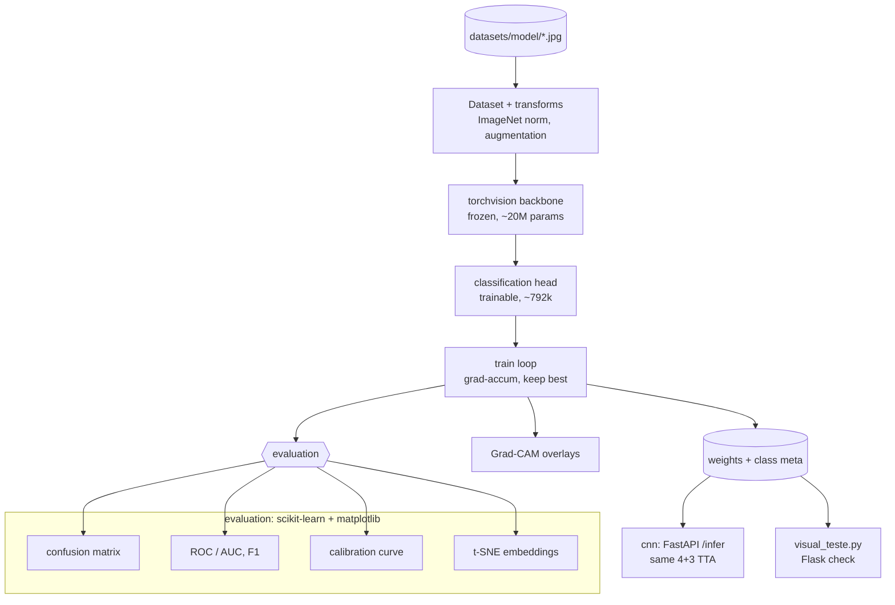

# cnn-ml

[](https://www.python.org/)
[](https://pytorch.org/)
[](LICENSE)

> PyTorch training pipeline for [cnn](https://github.com/leobaray/cnn): classifies automotive torque-converter / CVT models from one photo. Frozen torchvision backbone with a trained head, test-time augmentation, Grad-CAM, and scikit-learn/matplotlib evaluation. Produces the weights the FastAPI `/infer` endpoint loads.

---

## Why this exists

Torque-converter and CVT models are identified in the field by stamped codes that wear off or by paper catalogs. Several models look nearly identical and differ only in small features, so misidentification is common and sends the wrong remanufactured unit out.

This repository trains the classifier that [cnn](https://github.com/leobaray/cnn) uses: one photo in, model and confidence out. It is a single `train.py` with a frozen pretrained backbone and fixed seeds, so adding a class is one training run.

---

## Features

- Transfer learning: a pretrained torchvision backbone is frozen; only a classification head trains (~792k of ~21M parameters).
- Test-time augmentation: inference averages predictions over 4 flips and 3 rotations per image. The server's `/infer` repeats the same TTA.
- Grad-CAM: a prediction can be rendered as a class-activation overlay to see which region of the image drove it.
- Evaluation: confusion matrix, per-class precision/recall/F1, ROC/AUC, calibration curve, and a t-SNE projection of the penultimate embeddings.
- Two matplotlib themes: a dark (GitHub-style) palette and a monochrome hatch/linestyle mode for print.
- Fixed seed, ImageNet normalization, gradient accumulation, and deterministic train/val/test splits.

---

## Technical notes

- `build_model` / `get_base_model` load a pretrained torchvision CNN (~21M params), freeze the feature extractor, and attach a trainable head (~792k params).
- `grad_accum=2` over a batch of 16 gives an effective batch of 32 at 512×512.
- The 4-flip + 3-rotation TTA in `train.py` is the same averaging the server runs in `/infer`, so evaluation numbers match the served model.
- `train.py` sets the matplotlib Agg backend and two themes (dark `#0d1117` and a monochrome hatch/linestyle/marker set), so a run writes figures without a display.
- Developed on an RTX 5070 Ti (Blackwell), which required a current PyTorch build. Eval-only runs work on CPU.
- CLI via `argparse`: data dir, image size, epochs, splits, seed, grad-accum, resume, eval-only.

---

## Architecture



---

## Engineering decisions

### Frozen backbone

The dataset has a few thousand images per class. A full CNN trained from scratch at that scale overfits, so the pretrained backbone stays frozen and only the head (~792k params) trains. Unfreezing is one flag if the dataset grows.

### Test-time augmentation

Some classes differ by a small region of the frame. Averaging logits over 4 flips and 3 rotations lowers variance on those cases. The cost is the extra forward passes per image, which the GPU absorbs inside the latency the app needs.

### Grad-CAM

The overlay shows which region produced a prediction, so a wrong classification can be traced to the image (a label, glare, background) instead of being opaque.

### Separate from the app

The model is retrained and versioned on its own cadence, unrelated to the Android or backend release cycle in [cnn](https://github.com/leobaray/cnn). That repo depends on the exported weights, not on this training code.

---

## Tech stack

| Layer | Choice | Notes |
|-------|--------|-------|
| Framework | PyTorch 2.10 + torchvision | CUDA (Blackwell / RTX 5070 Ti), CPU fallback |
| Model | pretrained CNN backbone (frozen) + head | ~21M total, ~792k trainable |
| Evaluation | scikit-learn | confusion, ROC/AUC, F1, calibration, t-SNE |
| Plots | matplotlib (Agg) | dark + monochrome themes |
| Images | Pillow + NumPy | ImageNet normalization |
| Local check | Flask | `visual_teste.py` |

---

## Project structure

```
cnn-ml/
├── train.py          # data, model, train loop, TTA, Grad-CAM, evaluation + plots
├── visual_teste.py   # Flask UI to inspect a trained model (predictions + Grad-CAM)
├── requirements.txt
└── .gitignore        # datasets/ and output/ stay local
```

Datasets and trained weights are not committed. Point `--data_dir` at a `datasets/<model>/*.jpg` tree; runs write weights and figures under `output/`.

---

## Getting started

Python 3.10+, and a CUDA GPU for training (CPU works for eval-only).

```bash
git clone https://github.com/leobaray/cnn-ml.git
cd cnn-ml

python -m venv .venv
. .venv/Scripts/activate        # .venv/bin/activate on Linux/macOS
pip install -r requirements.txt

# Train (expects datasets/<class>/*.jpg)
python train.py --data_dir ./datasets --img_size 512 --epochs 100 --batch_size 16 --grad_accum 2

# Evaluate an existing model and regenerate plots
python train.py --eval_only

# Local visual check (Flask)
python visual_teste.py
```

| Flag | Default | Purpose |
|------|---------|---------|
| `--data_dir` | `./datasets` | one subfolder per class |
| `--img_size` | `512` | input resolution |
| `--epochs` | `100` | training epochs |
| `--batch_size` | `16` | per-step batch |
| `--grad_accum` | `2` | multiplies the effective batch |
| `--val_split` / `--test_split` | `0.2` / `0.1` | holdout fractions |
| `--seed` | `42` | reproducibility |
| `--eval_only` | `false` | skip training, evaluate and plot |

---

## Scale

In production use. The classifier covers 180 torque-converter models trained on ~4,400 images per class (~792k images total). End-to-end identification (capture, server inference with TTA, response) runs at ~2.36 s median on an RTX 5070 Ti; latency depends on the server GPU.

---

## What I'd do differently

- No tests yet. Cases around the dataset split, the TTA averaging, and the export format would catch regressions that currently only show up in the plots.
- `train.py` holds data, model, loop, evaluation, and plotting in one file. Evaluation and plotting belong in a separate module.
- Metrics render to PNG only. Writing the raw numbers as JSON would let runs be compared without reading charts.
- ONNX/TorchScript export should be a step here with a parity check against the PyTorch logits, rather than the server loading raw weights.

---

## Related projects

- [cnn](https://github.com/leobaray/cnn) — Android (Jetpack Compose) client and FastAPI server that serve this model.
- [epi_system](https://github.com/leobaray/epi_system) — industrial PPE manager, NR-6 / eSocial compliant, single stdlib Python process.

---

## Contact

Leonardo Baray Machado, Curitiba, Brazil. Open to remote engineering roles.

- GitHub: [@leobaray](https://github.com/leobaray)
- Email: leonardobaray@outlook.com

---

Licensed under the MIT License — see [LICENSE](LICENSE).
