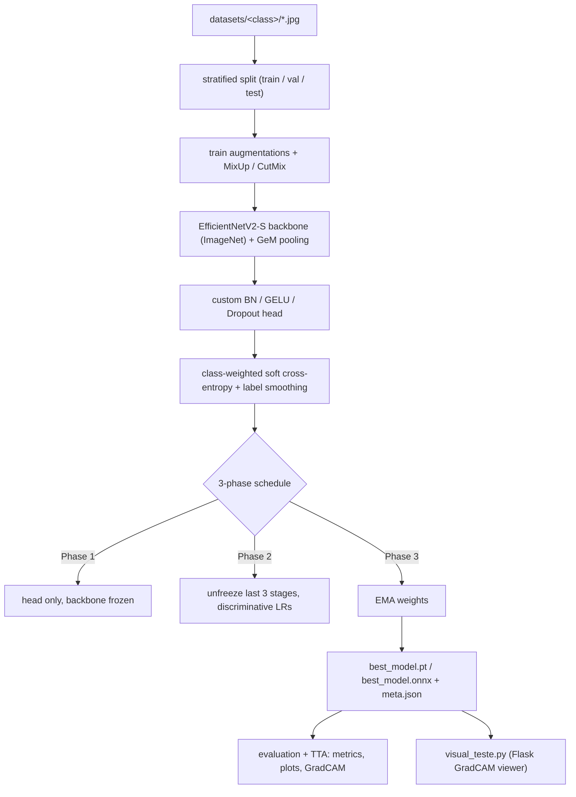

# cnn-ml


An end-to-end PyTorch pipeline for fine-grained image classification: a fine-tuned **EfficientNetV2-S** with GeM pooling, a three-phase training schedule, and a full evaluation + interpretability suite — plus a small Flask viewer for eyeballing predictions and GradCAM heatmaps.

## What it solves

Training a strong classifier on a small, class-imbalanced, folder-organized image dataset takes far more than `model.fit`. This repo packages the parts that usually get reinvented per project: a transfer-learning schedule that actually converges without overfitting, the regularization stack that makes it work (MixUp/CutMix, heavy augmentation, label smoothing, class weighting), and the evaluation you need to trust the result (calibration, ROC/AUC, per-class F1, misclassification review, embedding structure, and GradCAM to see *where* the model looks). Point it at a directory of labeled images and it produces trained weights, an ONNX export, and a full plot report.

## Features

**Model**
- EfficientNetV2-S backbone (ImageNet-pretrained) with **GeM** (generalized mean) pooling replacing global average pooling.
- Custom classifier head: `BatchNorm → Linear(512) → BatchNorm → GELU → Dropout → Linear(256) → BatchNorm → GELU → Dropout → Linear(num_classes)` (a BatchNorm before each Linear).

**Training**
- **Three-phase schedule**: (1) train the head with the backbone frozen, (2) unfreeze the last three backbone stages and fine-tune with discriminative learning rates (backbone LR much lower than the head), keeping BatchNorm frozen, (3) a final EMA-weighted phase, keeping whichever of the EMA or best checkpoint has the lower validation loss.
- Regularization: **MixUp + CutMix** (randomly alternated), RandomResizedCrop / flips / rotation / affine / color jitter / Gaussian blur / RandomErasing, label smoothing, and **class-weighted soft cross-entropy** for imbalanced data.
- Warmup + cosine LR schedule, gradient clipping, gradient accumulation, and early stopping on validation loss.
- GPU throughput: automatic mixed precision (AMP), `channels_last` memory format, TF32, cuDNN autotuning, and optional `torch.compile` (CUDA, non-Windows).
- Reproducible seeding; **stratified** train/val/test split with a graceful fallback for classes with too few samples.

**Evaluation & interpretability**
- 7-way **test-time augmentation** (identity, flips, 90/180/270° rotations).
- Metrics/plots: classification report, confusion matrix, per-class F1, ROC curves + AUC, calibration curve, confidence histogram, misclassification grid, **t-SNE** of penultimate embeddings, and **GradCAM** overlays — plus a combined dashboard. Every plot is written as **PNG and SVG**, with an optional print-friendly black-and-white mode (`--bw`).
- **ONNX export** (opset 17, dynamic batch axis) and a JSON dump of the run config, GPU info, and parameter counts.

**Inference viewer** (`visual_teste.py`)
- A single-file Flask app: drag-and-drop an image, get the Top-5 class probabilities and a GradCAM heatmap over the original, with an in-memory history of recent predictions.

## Tech stack

| Area | Tooling |
|------|---------|
| Language | Python 3.10+ |
| DL framework | PyTorch `>=2.10`, torchvision `>=0.25` |
| Metrics / t-SNE / splits | scikit-learn `>=1.4` |
| Arrays / images | NumPy `>=1.26`, Pillow `>=10.0` |
| Plotting | matplotlib `>=3.8` |
| Web viewer | Flask `>=3.0` |

## Architecture



`visual_teste.py` imports the model definition and transforms directly from `train.py`, so the served model is exactly the trained architecture — no drift between training and inference.

## Getting started

### Prerequisites
- Python 3.10 or newer.
- An NVIDIA GPU with CUDA is strongly recommended (the pipeline enables AMP, TF32, and `torch.compile` when CUDA is present). It falls back to CPU automatically, but training at the default 512 px resolution will be slow.

### Install

```bash
pip install -r requirements.txt
```

### Data layout

One folder per class; the folder name becomes the label. Accepted extensions: `.jpg .jpeg .png .bmp .webp`.

```
datasets/
├── class_a/
│   ├── img001.jpg
│   └── img002.png
└── class_b/
    └── img003.webp
```

### Train

Defaults match the flags below, so a bare invocation works once `datasets/` exists:

```bash
python train.py \
  --data_dir datasets \
  --output_dir output \
  --img_size 512 \
  --batch_size 16 \
  --grad_accum 2 \
  --epochs 100
```

| Flag | Default | Purpose |
|------|---------|---------|
| `--img_size` | `512` | Input resolution (square). |
| `--batch_size` / `--grad_accum` | `16` / `2` | Effective batch = `batch_size × grad_accum` (32). |
| `--epochs` | `100` | Split ~40% / 30% / 30% across the three phases. |
| `--val_split` / `--test_split` | `0.2` / `0.1` | Stratified holdout fractions. |
| `--seed` | `42` | Reproducibility. |
| `--resume` | off | Continue from an existing `best_model.pt`. |
| `--eval_only` | off | Skip training; load the saved model and regenerate metrics/plots. |
| `--bw` | off | Print-friendly black-and-white plots. |

### Outputs

```
output/
├── models/    best_model.pt, latest_model.pt, best_model.onnx, meta.json, config.json
├── history/   training_history.json
└── results/   classification_report.txt + PNG/SVG plots
                (loss, accuracy, LR, grad-norm, confusion matrix, per-class F1,
                 ROC, calibration, confidence histogram, error grid, t-SNE,
                 GradCAM samples, dashboard)
```

### Run the viewer

Requires a trained model — i.e. `output/models/best_model.pt` and `output/models/meta.json` must already exist.

```bash
python visual_teste.py
# then open http://localhost:5000
```

## Project structure

```
cnn-ml/
├── train.py           # training + evaluation + interpretability + ONNX export (single file)
├── visual_teste.py    # Flask GradCAM viewer; imports the model/transforms from train.py
└── requirements.txt
#
# created at runtime (not committed):
#   datasets/   input images, one folder per class
#   output/     checkpoints, ONNX, metrics, plots
#   uploads/    viewer upload/heatmap cache
```

## Status & limitations

- **Personal project.** The training and inference paths are exercised on CUDA (the author develops on a recent NVIDIA GPU); CPU works but is slow, and some fast paths (`torch.compile`, `channels_last`, TF32) only activate on CUDA.
- **No automated test suite** ships with this repo.
- **The viewer is a local inspection tool, not a production server.** It runs on Werkzeug's development server and saves uploads under the original filename without sanitization — do not expose it to untrusted networks as-is.
- **Weights and datasets are not included.** You must train before the viewer or ONNX consumers have anything to load.
- This is the **ML / training half** of a two-repository split; the end-user web frontend lives in a separate repository.

## License

MIT.
